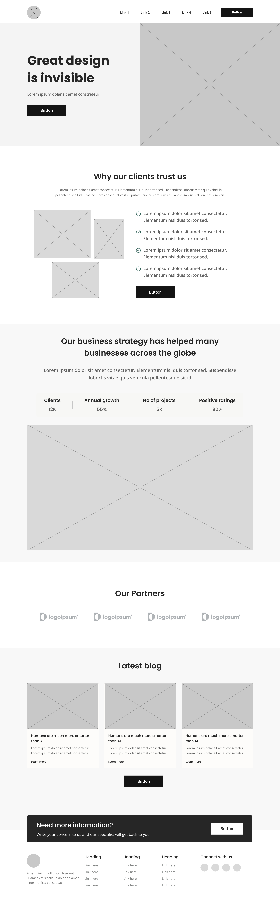

# 🧩 Desafio: Wireframe de Média Fidelidade

## ✨ Sobre o Projeto

Este repositório reúne o desafio proposto pelo curso de UX/UI da DIO: criar um **wireframe de média fidelidade** para uma **One Page** de um produto à sua escolha, aplicando conceitos de psicologia do design e **leis de usabilidade** (como as de Bastien e Nielsen).

---

## 🎯 Objetivos de Aprendizagem

- **Wireframe:** planejar e desenhar uma interface de média fidelidade para um produto (app, landing page, produto de aula etc.).  
- **Psicologia & Usabilidade:** usar princípios de percepção, hierarquia visual e heurísticas de Nielsen/Bastien para tornar a experiência intuitiva.  
- **Ferramentas:** Figma  
- **Documentação:** registrar objetivos, decisões de design e justificar escolhas no GitHub.

---

## ✅ Leis de Usabilidade Aplicadas

### Leis de UX:

- **Lei de Fitts:** elementos clicáveis como botões são grandes e posicionados em locais de fácil acesso, facilitando a interação rápida.
- **Lei de Hick-Hyman:** a navegação principal contém poucos itens (5 links + 1 botão), reduzindo o tempo de decisão do usuário.
- **Lei de Miller:** a estrutura do conteúdo respeita a limitação da memória de trabalho humana (~7 blocos de informação por vez).

### Heurísticas de Nielsen aplicadas:

- **Visibilidade do status do sistema:** uso de botões e CTAs visíveis para indicar ações possíveis.
- **Consistência e padrões:** padrões visuais e estruturas repetidas ao longo da página.
- **Reconhecimento em vez de memorização:** uso de ícones, rótulos e seções familiares ao usuário.

### Princípios de Bastien & Scapin:

- **Controle do usuário:** fluxos com chamadas para ação claras.
- **Legibilidade:** tipografia limpa, hierarquia de texto e espaçamento adequado.
- **Feedback imediato:** simulado por botões destacados e áreas de destaque.
- **Prevenção de erros:** layout orientado à ação com agrupamento lógico de informações.

---

## 🖌 Wireframe

Wireframe de média fidelidade criado no Figma com foco em estrutura, hierarquia e clareza na navegação.

---

## 🛠 Tecnologias & Ferramentas

- Figma  
- Git & GitHub

  

